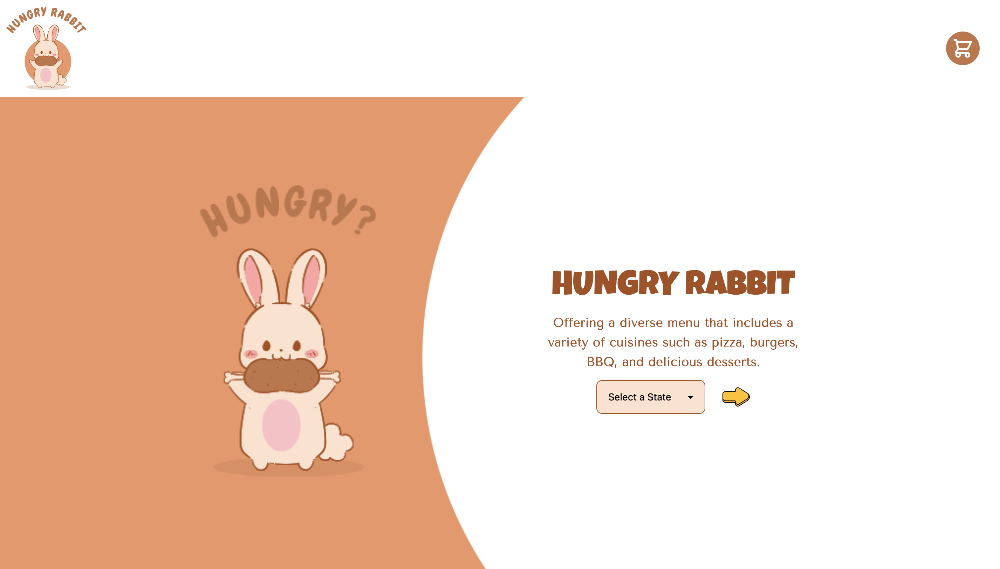
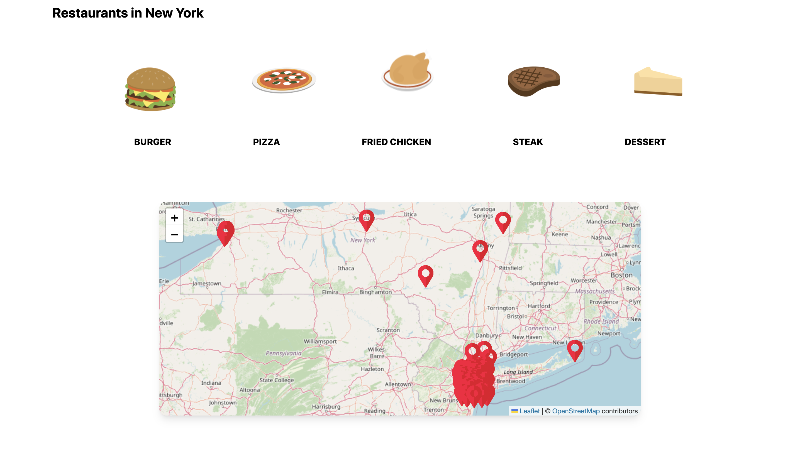
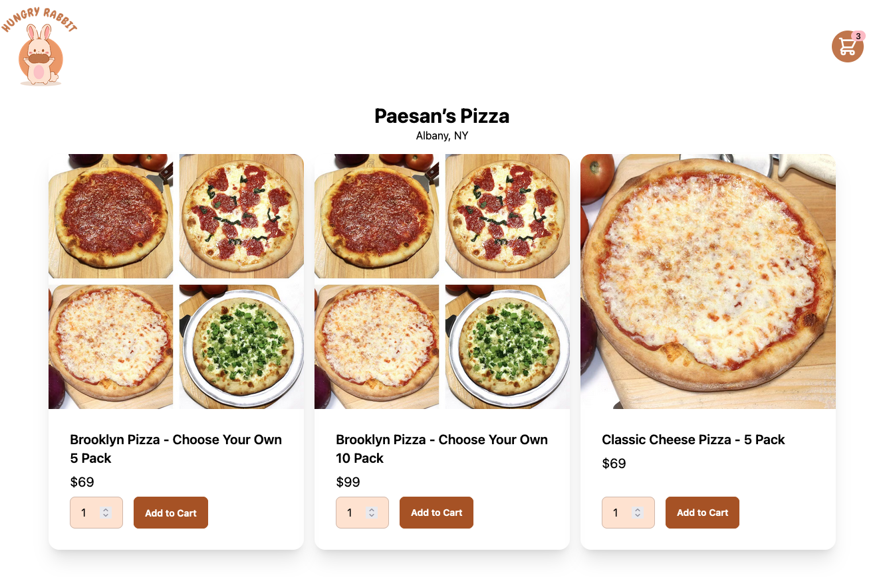
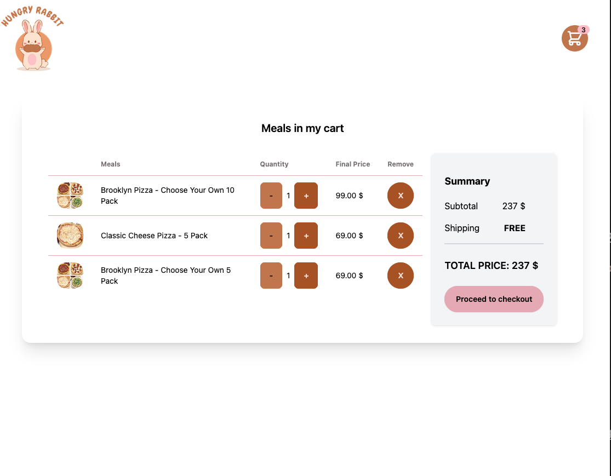
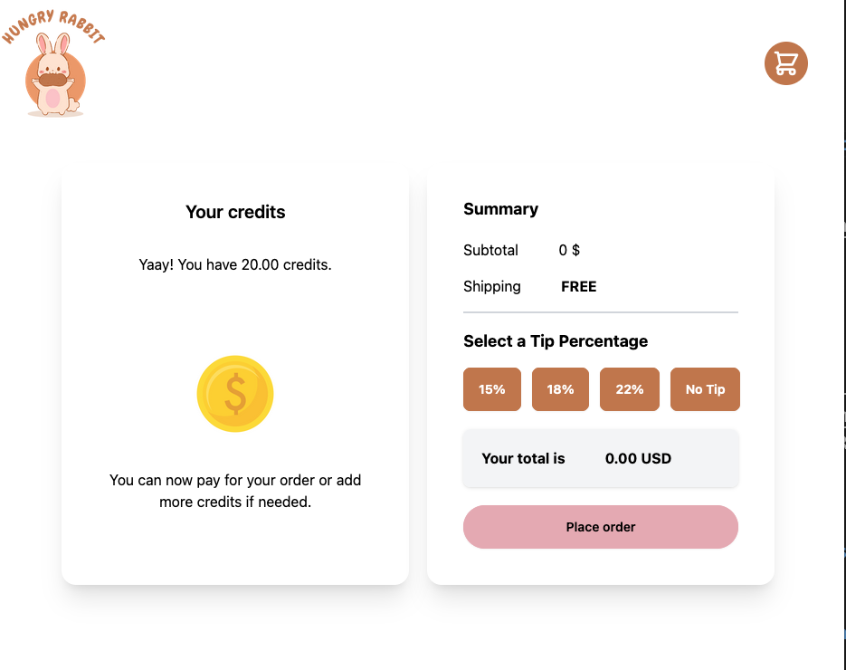

# HUNGRY RABBIT

<!--Hungry Rabbit is a food search app that offers a variety of meals to choose from in your location.-->

Hungry Bunny is a newly established food delivery service in the market. Our goal,
is to attract potential customers to utilize our company's web application food delivery
services to the customer’s location.

# About us

We're a team of developers and  a UI/UX designer from all over the world who love two things: eating and coding. We've worked tirelessly to bring this app to life, and we hope you enjoy using it as much as we enjoyed creating it. Bon appétit and happy
searching!
 

## Table of contents

- [Overview](#overview)
 - [Screenshot](#screenshot)
 - [Links](#links)
- [Our process](#my-process)
 - [Built with](#built-with)
 - [What We learned](#what-i-learned)
 - [Continued development](#continued-development)
 - [Useful resources](#useful-resources)
- [Our Team](#our-team)
- [Acknowledgments](#acknowledgments)

## Overview

### Screenshots 

Main Page:

Map Page:

Menu page:

Cart page:

Checkout page:

### Links

- Case study: [Case study](https://boatneck-brie-0a1.notion.site/Hungry-Bunny-221b2d2f3ddb4481b0807af823508bbf)
- Solution URL: [Github](https://github.com/chingu-voyages/v50-tier2-team-14)
- Live Site URL: [Hungry rabbit](https://hungry-rabbit.onrender.com/)

## Our process

### Built with

- [React](https://reactjs.org/) - JS library
- Redux
- DaisyUI
- Tailwind CSS
- [Menus API](https://menus-api.vercel.app/)
- [Leaflet.js](https://react-leaflet.js.org/)

### What we learned

We built the application using the Agile/Scrum methodology, which allowed us to maintain flexibility and adaptability throughout the development process. We utilized Jira for project management, ensuring that all tasks were tracked, prioritized, and completed efficiently, fostering clear communication and collaboration among team members. The interfaces were crafted based on Figma prototypes provided by team’s UX/UI designer, ensuring a user-centric design that met the project's requirements.

## Our Team

| Name | Role | GitHub | LinkedIn |
| ----------- | ----------- | ----------- |----------- |
| Jorge Alvarado | Developer | [Alvarado08](https://github.com/Alvarado08) | [in/jorgep-alvarado](https://www.linkedin.com/in/jorgep-alvarado) |
| Olga Yudkin | Developer | [cvtqx](https://github.com/cvtqx) | [in/olga-yudkin](https://www.linkedin.com/in/olga-yudkin/) |
| Natalie Chan | Developer | [Natkuma01](https://github.com/Natkuma01) | [in/natalie-chan-shimin](https://www.linkedin.com/in/natalie-chan-shimin/) |
| Adrienne Burney | UI/UX designer| [Adrienne-B](https://github.com/Adrienne-B) | [in/adrienne-b](https://www.linkedin.com/in/adrienne-burney-ux-ui-designer/) |

## Acknowledgments  

Coin image by rawpixel.com on Freepik[Coin vector](https://www.freepik.com/free-vector/dollar_2900482.htm#fromView=search&page=1&position=1&uuid=9c61a593-8ea9-46b0-880b-00cd41eb97b9)

Logo and color theme created with [Canva](https://www.canva.com/design/DAGKejxw9WU/0gOPD48dQP9Iu-yOPeOxfA/view?utm_content=DAGKejxw9WU&utm_campaign=designshare&utm_medium=link&utm_source=editor)

